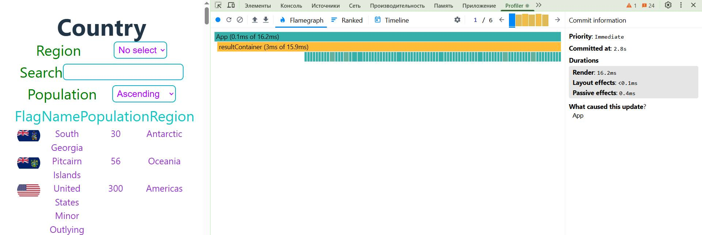
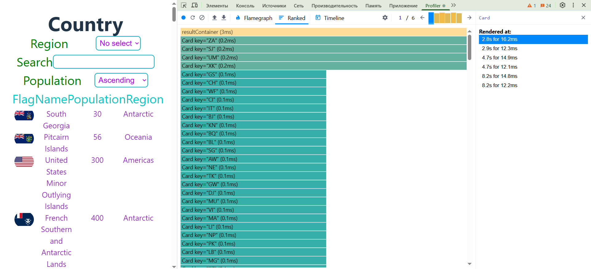
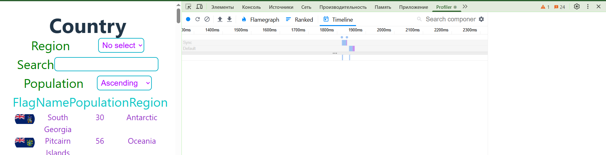
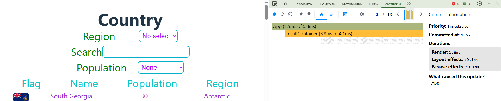
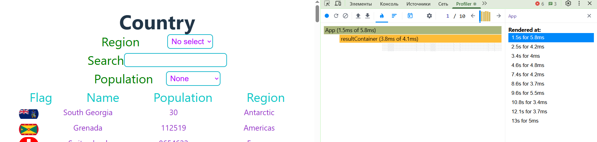
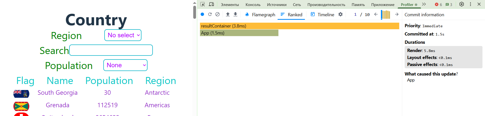
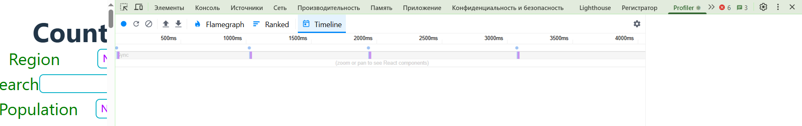

# React Performance

**Initial Profiling with React Dev Tools Profiler**
Sorting Population (ascending/descending)

- **Parameters to Check:**
  - **Commit Duration:** 2.8s
  - **Render Duration:** 16.2ms
  - **Interactions:** App
  - **Flamegraph:**
    
  - **Ranked**
    
  - **Timeline:**
    

**Update the App with React.memo and useMemo**

- **Parameters to Check:**
  - **Commit Duration:** 1.5s
  - **Render Duration:** 5.8ms
  - **Interactions:** App
  - **Flamegraph:**
    
    - **App Flamegraph:**
    
  - **Ranked**
    
  - **Timeline:**
    

    After optimizations 

**Key Improvements**
- Commit Duration Reduced by 46%: From 2.8s to 1.5s.

- Render Duration Reduced by 64%: From 16.2ms to 5.8ms.

- Fewer Unnecessary Re-renders: By using React.memo, useCallback, and useMemo, the number of re-renders was significantly reduced, improving overall performance.

**Conclusion**
The optimizations, including the use of React.memo for card components, useCallback for event handlers, and useMemo for data filtering and sorting, halved the rendering time of components. These changes resulted in a smoother user experience and more efficient resource utilization.